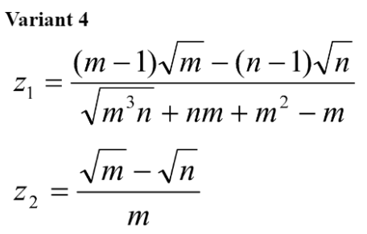
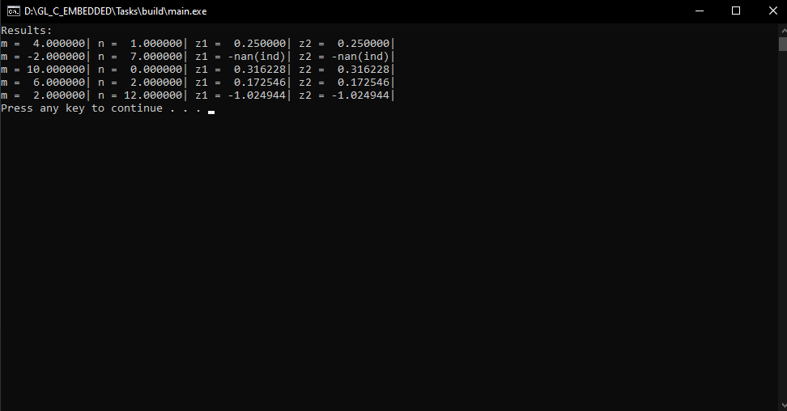

# GL_EmbeddedC
A set of tasks for C/Embedded

Task_1 execution result:

Task_2 formulas:

Task_2 execution result:

There is a possibility that the formulas from Task_2 are equal. Let's try to prove it.

Task_2 proof:
